# 🌿 EcoTrust Pay - Sustainable E-Commerce Platform

<div align="center">

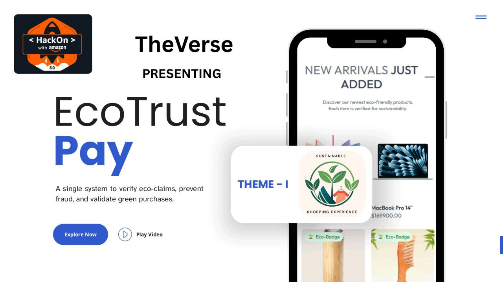

**A single system to verify eco-claims, prevent fraud, and validate green purchases**

[](https://theverse-hackon5-ecotrustpay-frontend.onrender.com/)
[](https://theverse-hackon5-ecotrustpay-frontend.onrender.com/)
[](https://theverse-hackon5-ecotrustpay-seller.onrender.com/)
[](https://theverse-hackon5-ecotrustpay-admin.onrender.com/)

</div>

## 🎯 Project Overview

EcoTrust Pay is a revolutionary sustainability-focused e-commerce platform that makes green shopping transparent, trustworthy, and rewarding. Our mission is to support Amazon's ambitious Net Zero 2040 goal by making sustainable shopping easier and cutting down on carbon emissions through smart group ordering and verified eco-claims.

### 🔥 Live Platform Links

| Platform             | Link                                                                          | Status  |
| -------------------- | ----------------------------------------------------------------------------- | ------- |
| 🛍️ **Customer App**  | [Shop Now](https://theverse-hackon5-ecotrustpay-frontend.onrender.com/)       | ✅ Live |
| 🏪 **Seller Portal** | [Seller Dashboard](https://theverse-hackon5-ecotrustpay-seller.onrender.com/) | ✅ Live |
| ⚙️ **Admin Panel**   | [Admin Dashboard](https://theverse-hackon5-ecotrustpay-admin.onrender.com/)   | ✅ Live |
| 🔧 **API Backend**   | [API Docs](https://jaideepbose51.github.io/api-doc/)                          | ✅ Live |

---

## 🎥 Platform Demo

<div align="center">

[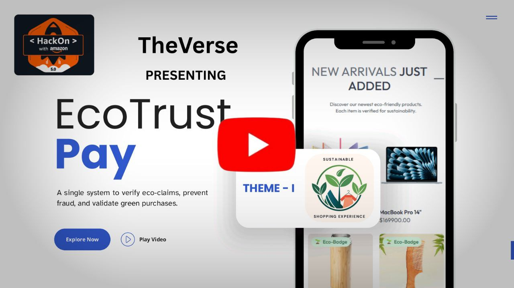](https://youtu.be/yApPTYxYPiU?si=AUdVj05OYvK-Q8hF)

_Click to watch our comprehensive platform walkthrough and demo_

</div>

---

## 📄 Documentation

The full project documentation and walkthrough is available here:  
🔗 [https://jaideepbose51.github.io/api-doc/](https://jaideepbose51.github.io/api-doc/)

This includes:

- Live website
- Feature walkthrough
- User & Seller flows
- Eco-verification demo

---

## 🧪 Test Credentials

### 👨‍💼 Admin Access

- **Email:** `jaideepbose@gmail.com`
- **Password:** `JAIDEEP1234`
- **Role:** Full platform administration

### 🏪 Seller Account

- **Email:** `tester3@gmail.com`
- **Password:** `*Jaideep03`
- **Role:** Verified seller with eco-product listings

### 👤 Customer Account

- **Email:** `ayush@gmail.com`
- **Password:** `Ayush123`
- **Group Delivery Check PIN Code:** `800011 or 751024`
- **Group Delivery Manual Check:** Order to same PIN Code twice
- **Role:** Regular customer with purchase history

---

## 🚀 Core Problems We Solve

<div align="center">

| Problem                             | Solution                       | Impact                                   |
| ----------------------------------- | ------------------------------ | ---------------------------------------- |
| 🚫 **42.3% don't trust eco-claims** | AI-powered verification system | ✅ 87% confidence scoring                |
| 🎭 **Greenwashing & fake logos**    | Mandatory seller verification  | ✅ Only authentic sellers                |
| 👀 **No visibility into impact**    | Real-time CO₂ tracking         | ✅ Measurable environmental contribution |
| 📦 **High delivery emissions**      | Smart group ordering           | ✅ Reduced last-mile carbon footprint    |

</div>

---

## ✨ Key Features

### 🔍 **Eco-Verification System**

Our AI-powered 3-step verification process ensures every eco-claim is legitimate. When a seller uploads a new product, our platform begins a comprehensive eco-verification process:

- **Step 1:** Seller provides at least one product image along with basic details like name, category, and price
- **Step 2:** Seller fills in eco-specific fields such as the eco label (e.g., Organic, Recycled) and a description explaining why the product is eco-friendly
- **Step 3:** By clicking the "Verify Eco Status" button, the system checks both the image and description using AI to determine if the product deserves an "Eco Verified" badge

If verified, the badge appears along with a confidence percentage (e.g., "Verified – 87% Confidence") to give buyers transparency. If the product doesn't qualify, a warning is shown instead, clearly stating the reason why the claim was not verified.

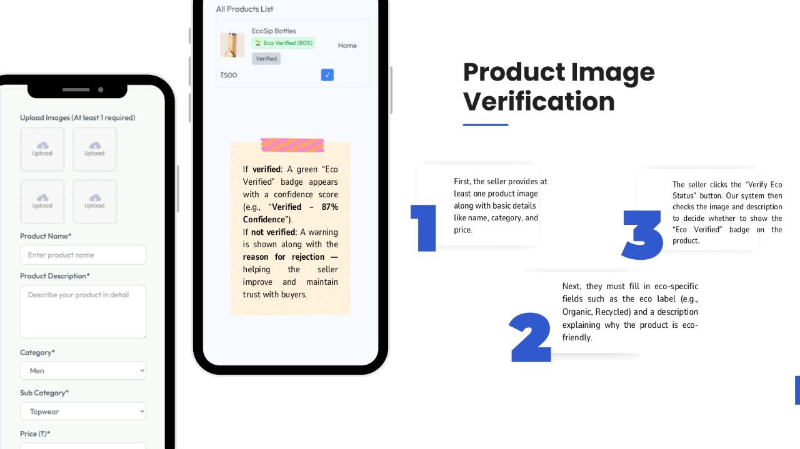

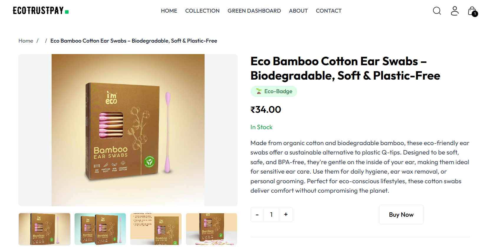

### 🏪 **Seller Verification Process**

To maintain credibility in eco-commerce, every seller must go through a rigorous verification process before listing any products:

1. **Registration:** First, the seller registers on the platform by providing basic details such as shop name, email, password, and contact number
2. **Documentation:** Second, to request verification, the seller must submit key business information — including shop photos, purchase bills, sourcing details, brand association documents, and eco-related certifications
3. **Admin Review:** Third, this verification request is automatically forwarded to the admin panel. The admin carefully reviews the submitted data and either approves or rejects the seller
4. **Approval:** Only after successful verification is the seller allowed to list products and use eco-labels, ensuring that only authentic sellers are visible to customers

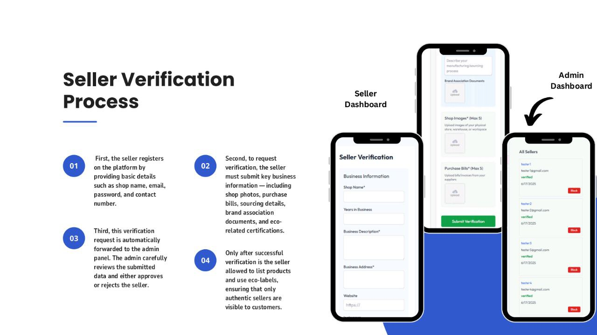

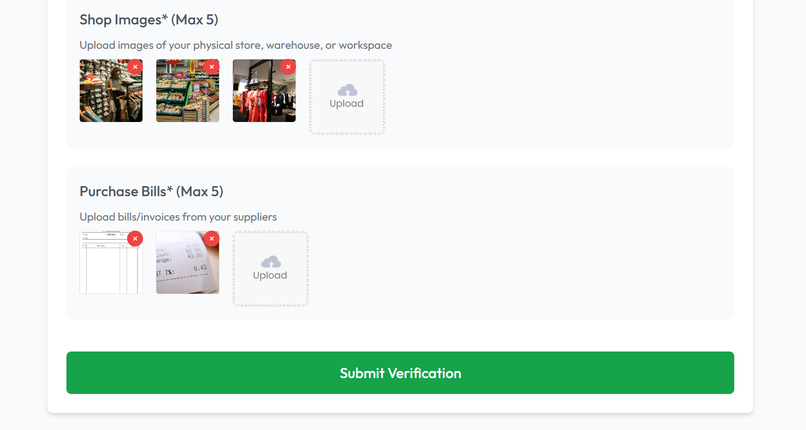

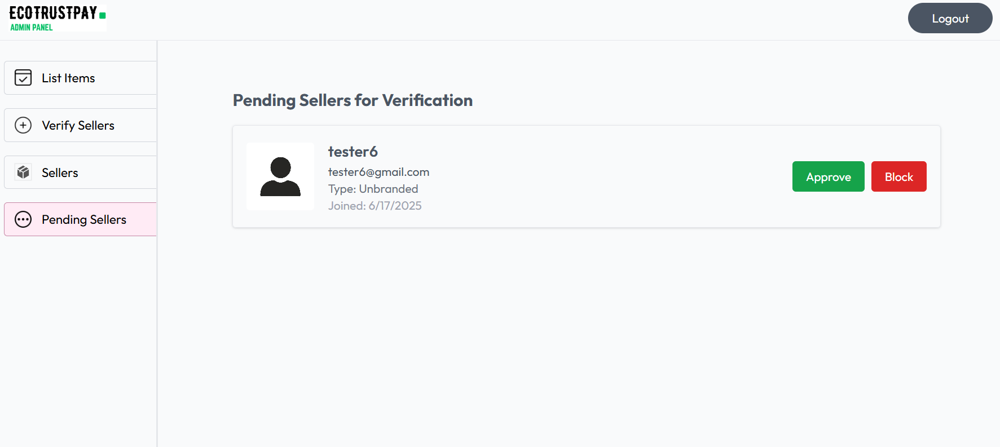

### 📊 **Personal Eco Impact Dashboard**

Each user has a personal dashboard that displays how much CO₂ they've saved through eco-verified purchases and grouped deliveries. This feature gives users a real sense of their contribution to the environment, turning abstract eco-goals into measurable impact.

Users can view a detailed list of their past purchases that were verified as eco-friendly. This not only builds trust by providing transparency, but also motivates customers to continue shopping sustainably and track their progress over time.

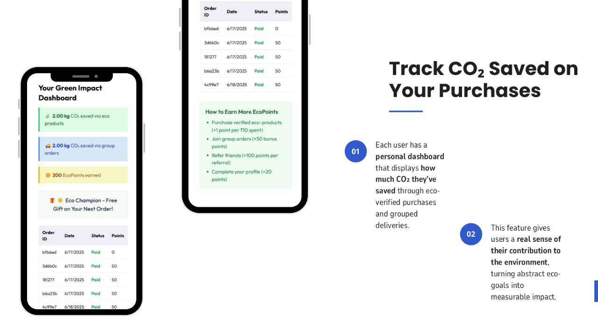

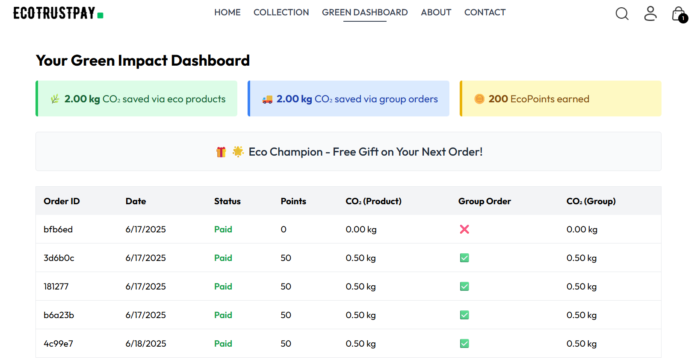

### 🚚 **Smart Group Delivery System**

Our platform identifies customers in the same area who have ordered eco-verified products within a similar timeframe. It then suggests combining those orders into a single delivery. This reduces the number of delivery trips, cuts down packaging waste, and significantly lowers last-mile carbon emissions — making sustainable shopping even more impactful.

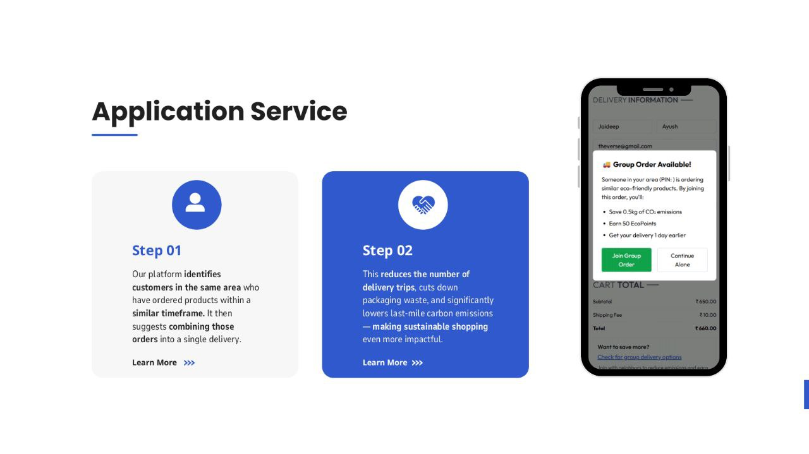

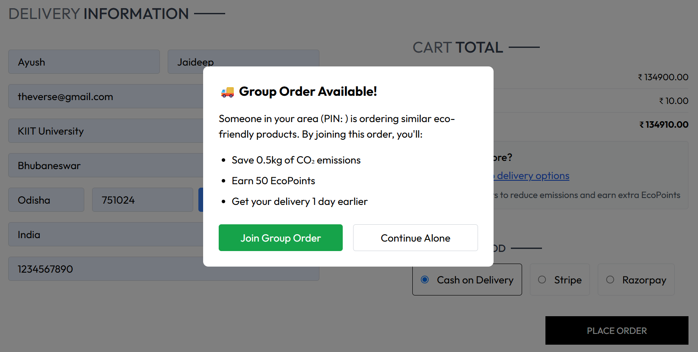

### ⚠️ **Real-Time Purchase Validation**

Before completing a purchase, the system re-checks whether the product is eco-verified. If not, a warning message appears during the add-to-cart or checkout stage, alerting the customer that the eco-claim is not yet verified. This real-time validation ensures that users are always informed before making a final purchase decision, reducing trust issues and potential returns.

If a seller marks a product as eco-friendly but the verification fails, the website displays a clear warning on the product card and details page. This warning informs users that the product has not been verified and may not meet genuine eco-standards.


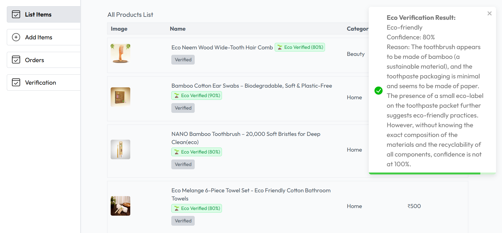

### 🏆 **Eco Buyer Rewards System**

To encourage eco-conscious behavior, users earn reward points for verified eco-purchases and group deliveries. These points help unlock eco-badges and levels — like "Eco-Champion" — adding a gamified layer that makes sustainability engaging and rewarding.

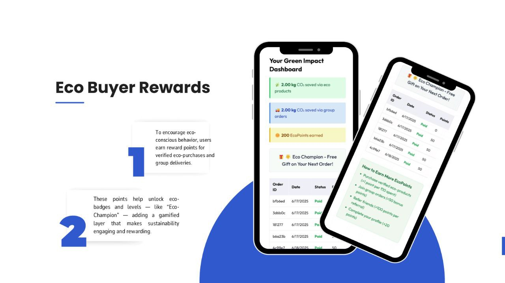


---

## 🛠️ Technical Architecture

### **Frontend Applications**

- **Customer App:** React.js with responsive design
- **Seller Portal:** Vue.js with advanced product management
- **Admin Dashboard:** Angular with comprehensive analytics

### **Backend Infrastructure**

- **API:** Node.js with Express.js framework
- **Database:** MongoDB with optimized schemas
- **Authentication:** JWT-based secure access
- **File Storage:** Cloudinary for image management
- **AI Integration:** Google Gemini for eco-verification

---

## 🚀 Quick Start

### Base URL

```
http://localhost:3000
```

### Authentication

Most endpoints require authentication using JWT tokens. Include the token in your request headers:

```
Authorization: Bearer <your_jwt_token>
```

### ⚡ Installation

```bash
# Clone the repository
git clone https://github.com/jaideepbose51/TheVerse-HackOn5-EcoTrustPay
cd ecotrust-pay

# Install backend dependencies
cd backend
npm install

# Install frontend dependencies
cd ../frontend
npm install

# Install seller portal dependencies
cd ../seller
npm install

# Install admin dashboard dependencies
cd ../admin
npm install
```

### 🔧 Environment Variables

Create a `.env` file in the root directory of backend with the following variables:

```env
PORT=3000
MONGODB_URI=
JWT_SECRET=
CLOUDINARY_CLOUD_NAME=
CLOUDINARY_API_KEY=
CLOUDINARY_API_SECRET=
ADMIN_EMAIL=
ADMIN_PASSWORD=
GEMINI_API_KEY=
```

Create a `.env` file in the root directory of Frontend, Seller, Admin with the following variables:

```env
VITE_BACKEND_URL='http://localhost:3000'
```

### 🏃‍♂️ Running the Application

```bash
# Start Backend Server
cd backend
npm run dev

# Start Customer Frontend
cd frontend
npm run dev

# Start Seller Portal
cd seller
npm run dev

# Start Admin Dashboard
cd admin
npm run dev
```

---

## 📋 Table of Contents

- [User Routes](#-user-routes)
- [Seller Routes](#-seller-routes)
- [Admin Routes](#️-admin-routes)
- [Environment Variables](#environment-variables)
- [Authentication](#-authentication)
- [Response Format](#-response-format)
- [Error Handling](#️-error-handling)

---

## 👥 User Routes

_Base URL: `/user`_

### 🛒 Product Discovery

#### Get All Products

```http
http://localhost:3000/api/user/
```

**Description:** Retrieve all available products in the marketplace
**Authentication:** Not required
**Response:** Array of product objects

---

### 🔑 Authentication & Profile

#### Register User

```http
POST http://localhost:3000/api/user/register
```

**Body:**

```json
{
  "name": "Test User",
  "email": "testuser@example.com",
  "password": "Test1234",
  "phone": "9876543210"
}
```

#### Login User

```http
POST http://localhost:3000/api/user/register
```

**Body:**

```json
{
  "email": "testuser@example.com",
  "password": "Test1234"
}
```

#### Get User Profile

```http
GET http://localhost:3000/api/user/profile
```

**Authentication:** Required
**Response:** User profile information

---

### 🛒 Shopping Cart Management

#### Add Item to Cart

```http
POST http://localhost:3000/api/user/cart/add
```

**Authentication:** Required
**Body:**

```json
{
  "productId": "507f1f77bcf86cd799439011",
  "catalogueId": "5f8d0f55b54764421b7156da",
  "quantity": 2,
  "size": "M"
}
```

#### Get Cart Contents

```http
GET http://localhost:3000/api/user/cart/get
```

**Authentication:** Required
**Response:** Current cart items with product details

#### Remove Item from Cart

```http
POST http://localhost:3000/api/user/cart/remove
```

**Authentication:** Required
**Body:**

```json
{
  "productId": "507f1f77bcf86cd799439011"
}
```

---

### 🧾 Order Management

#### Place Order

```http
POST http://localhost:3000/api/user/order
```

**Authentication:** Required
**Body:**

```json
{
  "isGroupOrder": false,
  "address": {
    "line1": "123 Main St",
    "city": "Bangalore",
    "zipCode": "560001"
  },
  "products": [
    {
      "productId": "507f1f77bcf86cd799439011",
      "catalogueId": "5f8d0f55b54764421b7156da",
      "quantity": 1,
      "size": "M"
    }
  ]
}
```

#### Get Order History

```http
GET http://localhost:3000/api/user/orders
```

**Authentication:** Required
**Response:** Array of user's order history

---

### 🌱 Eco-Friendly Features

#### Get Nearby Orders

```http
GET http://localhost:3000/api/user/orders/nearby
```

**Authentication:** Required
**Description:** Find orders in your vicinity for eco-friendly delivery clustering

#### Get User Eco Statistics

```http
GET http://localhost:3000/api/user/eco-stats
```

**Authentication:** Required
**Response:**

```json
{
  "carbonSaved": "45.2 kg",
  "localPurchases": 23,
  "ecoScore": 87,
  "greenBadges": ["Local Hero", "Carbon Reducer"]
}
```

---

## 🏪 Seller Routes

_Base URL: `http://localhost:3000/api/seller`_

### 🔑 Seller Authentication

#### Register Seller

```http
POST http://localhost:3000/api/seller/seller/register
```

**Body:**

```json
{
  "shopName": "Test Shop",
  "email": "seller@example.com",
  "password": "Test1234",
  "phone": "9876543210",
  "sellerType": "branded"
}
```

#### Login Seller

```http
POST http://localhost:3000/api/seller/login
```

**Body:**

```json
{
  "email": "seller@example.com",
  "password": "Test1234"
}
```

---

### 👤 Seller Profile Management

#### Get Seller Profile by id

```http
GET http://localhost:3000/api/seller/profile/:id
```

**Authentication:** Not Required

#### Get Seller Profile

```http
GET http://localhost:3000/api/seller/profile
```

**Authentication:** Required (Seller)

#### Add Advanced Seller Details

```http
PUT http://localhost:3000/api/seller/details
```

**Authentication:** Required (Seller)
**Content-Type:** `multipart/form-data`
**Form Fields:**

- `shopImages`: Up to 5 shop images
- `brandAssociations`: Up to 5 brand association documents
- `purchaseBills`: Up to 5 purchase bill documents
- Additional business details in JSON format

---

### 📦 Product Management

#### Add New Product

```http
POST http://localhost:3000/api/seller/products
```

**Authentication:** Required (Seller)
**Content-Type:** `multipart/form-data`
**Form Fields:**

- `image1`, `image2`, `image3`, `image4`: Product images
- `name`: Product name
- `description`: Product description
- `price`: Product price
- `category`: Product category
- `ecoFriendly`: Boolean for eco-friendly status

#### Get Seller Products

```http
GET http://localhost:3000/api/seller/product
```

**Authentication:** Required (Seller)
**Response:** Array of seller's products

#### Verify Eco Claim

```http
POST http://localhost:3000/api/seller/product/verify-eco/507f1f77bcf86cd799439011:id
```

**Authentication:** Required (Seller)
**Parameters:**

- `id`: Product ID to verify

---

## ⚙️ Admin Routes

_Base URL: `http://localhost:3000/api/admin`_

### 🔐 Admin Authentication

#### Admin Login

```http
POST http://localhost:3000/api/admin/login
```

**Body:**

```json
{
  "email": "jaideepbose@gmail.com",
  "password": "JAIDEEP1234"
}
```

---

### 👥 Seller Management

#### Get Pending Sellers

```http
GET http://localhost:3000/api/admin/sellers/pending
```

**Authentication:** Required (Admin)
**Description:** Retrieve sellers awaiting verification

#### Get All Sellers

```http
GET http://localhost:3000/api/admin/sellers
```

**Authentication:** Required (Admin)

#### Verify Seller

```http
PUT http://localhost:3000/api/admin/sellers/verify/:sellerId
```

**Authentication:** Required (Admin)
**Parameters:** `sellerId` - ID of seller to verify

#### Block/Unblock Seller

```http
PUT http://localhost:3000/api/admin/sellers/block/:sellerId
PUT http://localhost:3000/api/admin/sellers/unblock/:sellerId
```

**Authentication:** Required (Admin)
**Parameters:** `sellerId` - ID of seller to block/unblock

---

### 📊 Catalogue Management

#### Get All Catalogues

```http
GET http://localhost:3000/api/admin/catalogues
```

**Authentication:** Required (Admin)
**Description:** View all product catalogues in the system

---

### 📈 Reports & Analytics

#### Export Sellers Report

```http
GET http://localhost:3000/api/admin/reports/sellers
```

**Authentication:** Required (Admin)
**Response:** CSV file download with seller data

#### Export Catalogues Report

```http
GET http://localhost:3000/api/admin/reports/catalogues
```

**Authentication:** Required (Admin)
**Response:** CSV file download with catalogue data

---

## 🔐 Authentication

### JWT Token Structure

```json
{
  "userId": "507f1f77bcf86cd799439011",
  "role": "user|seller|admin",
  "email": "user@example.com",
  "exp": 1735689600
}
```

### Authentication Middleware

- **authUser**: Validates user authentication
- **isSeller**: Validates seller authentication
- **authAdmin**: Validates admin authentication

---

## 📊 Response Format

### Success Response

```json
{
  "success": true,
  "message": "Operation completed successfully",
  "data": {
    // Response data here
  },
  "timestamp": "2025-06-17T10:30:00Z"
}
```

### Error Response

```json
{
  "success": false,
  "error": {
    "code": "VALIDATION_ERROR",
    "message": "Invalid input data",
    "details": [
      {
        "field": "email",
        "message": "Valid email is required"
      }
    ]
  },
  "timestamp": "2025-06-17T10:30:00Z"
}
```

---

## ⚠️ Error Handling

### HTTP Status Codes

| Status Code | Emoji | Description           |
| ----------- | ----- | --------------------- |
| 200         | ✅    | Success               |
| 201         | ✅    | Created               |
| 400         | ❌    | Bad Request           |
| 401         | 🔒    | Unauthorized          |
| 403         | 🚫    | Forbidden             |
| 404         | 🔍    | Not Found             |
| 422         | ⚠️    | Validation Error      |
| 500         | 💥    | Internal Server Error |

### Common Error Codes

- `INVALID_CREDENTIALS`: Login credentials are incorrect
- `TOKEN_EXPIRED`: JWT token has expired
- `VALIDATION_ERROR`: Request data validation failed
- `RESOURCE_NOT_FOUND`: Requested resource doesn't exist
- `INSUFFICIENT_PERMISSIONS`: User lacks required permissions
- `PRODUCT_OUT_OF_STOCK`: Requested product is unavailable

---

## 🌟 Rate Limiting

- **General endpoints**: 100 requests per minute
- **Authentication endpoints**: 5 requests per minute
- **File upload endpoints**: 10 requests per minute

---

## 🧪 Testing

### Sample cURL Commands

```bash
# Register a new user
curl -X POST https://api.ecocommerce.com/api/v1/user/register \
  -H "Content-Type: application/json" \
  -d '{
    "name": "Test User",
    "email": "test@example.com",
    "password": "testpass123"
  }'

# Get all products
curl https://api.ecocommerce.com/api/v1/user/

# Add item to cart (authenticated)
curl -X POST https://api.ecocommerce.com/api/v1/user/cart/add \
  -H "Authorization: Bearer YOUR_JWT_TOKEN" \
  -H "Content-Type: application/json" \
  -d '{
    "productId": "507f1f77bcf86cd799439011",
    "catalogueId": "507f1f77bcf86cd799439012",
    "quantity": 1
  }'
```

---

## 🌱 Eco-Friendly Features

Our platform is built with sustainability in mind:

- **🚚 Smart Delivery**: Nearby order clustering reduces carbon footprint
- **📊 Eco Stats**: Track your environmental impact
- **🏆 Green Badges**: Earn rewards for sustainable choices
- **🌿 Verified Products**: Eco-friendly product verification system
- **📈 Sustainability Scoring**: Rate products on environmental impact

---

## 🛡️ Security Features

- **🔐 JWT Authentication:** Secure token-based access
- **🔒 Password Encryption:** Bcrypt hashing
- **🛡️ Input Validation:** Comprehensive data sanitization
- **🚦 Rate Limiting:** API abuse prevention
- **🔍 Admin Verification:** Manual seller approval process

---

<div align="center">

### 🌍 Building a Sustainable Future, One Purchase at a Time

**EcoTrust Pay - Where Trust Isn't Assumed, It's Earned**

[](https://github.com/yourusername/ecotrust-pay)

**Happy coding! 🎉 Let's build a more sustainable future together! 🌍**

</div>

---

_Last updated: June 19, 2025_
[](LICENSE)
## License

This project is licensed under the MIT License - see the [LICENSE](LICENSE) file for details.

